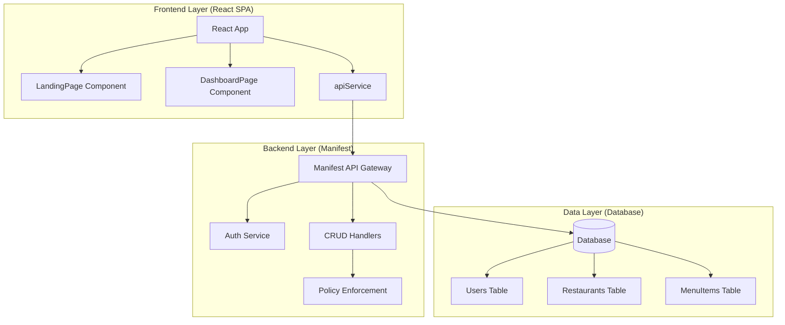
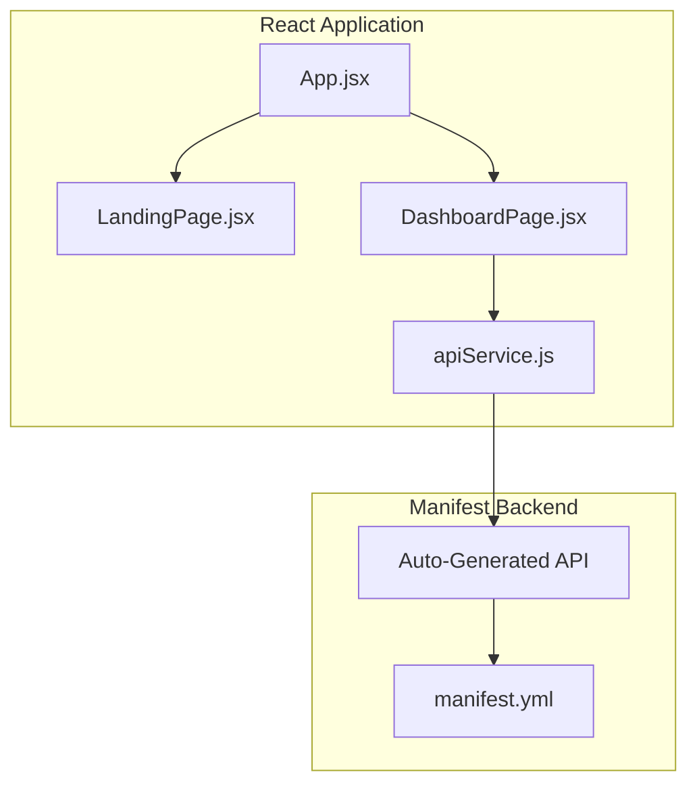
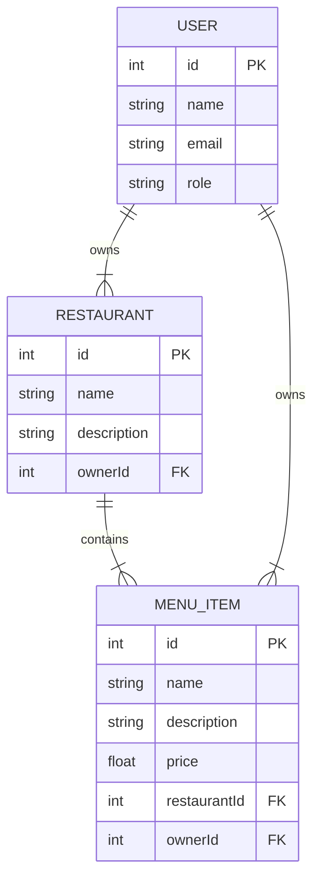
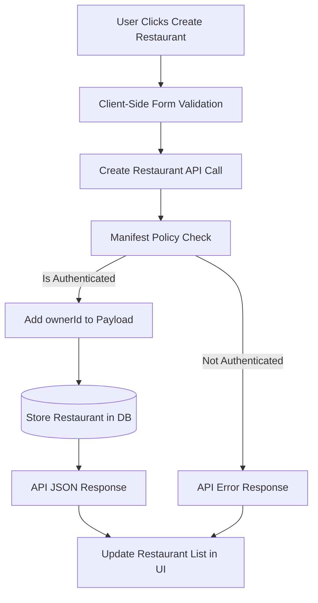
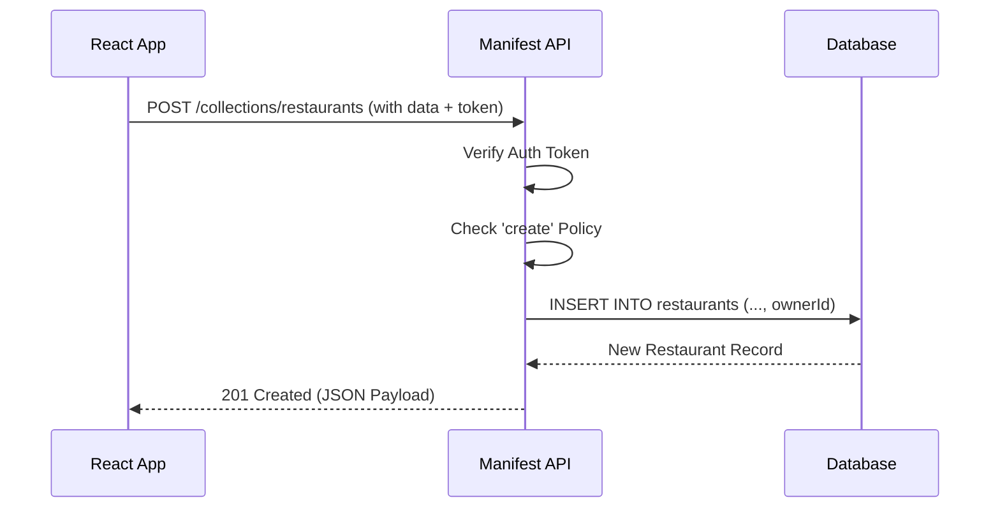
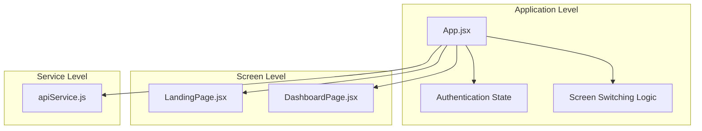
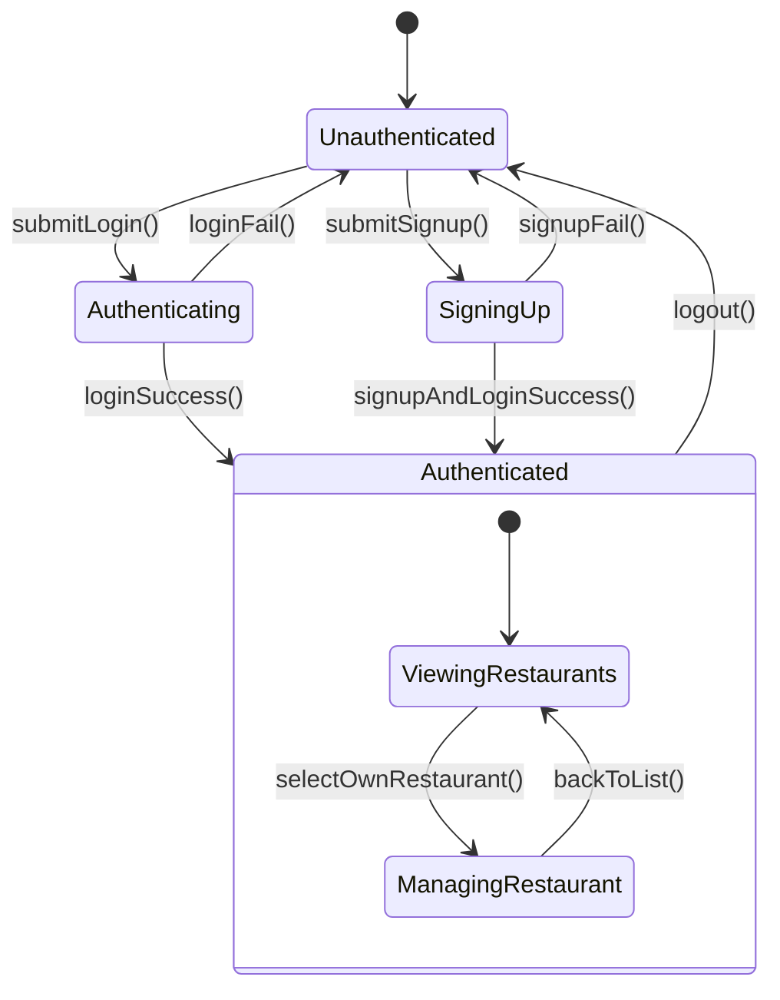
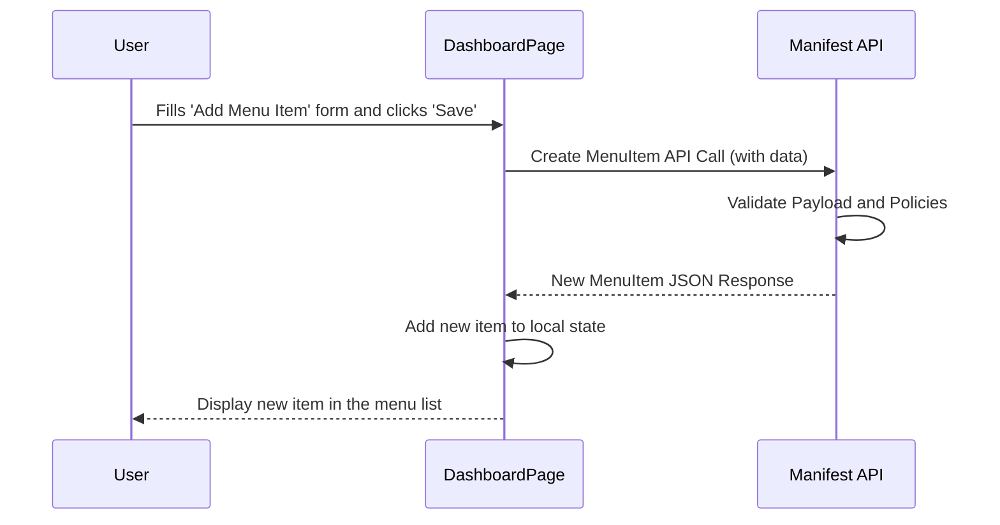
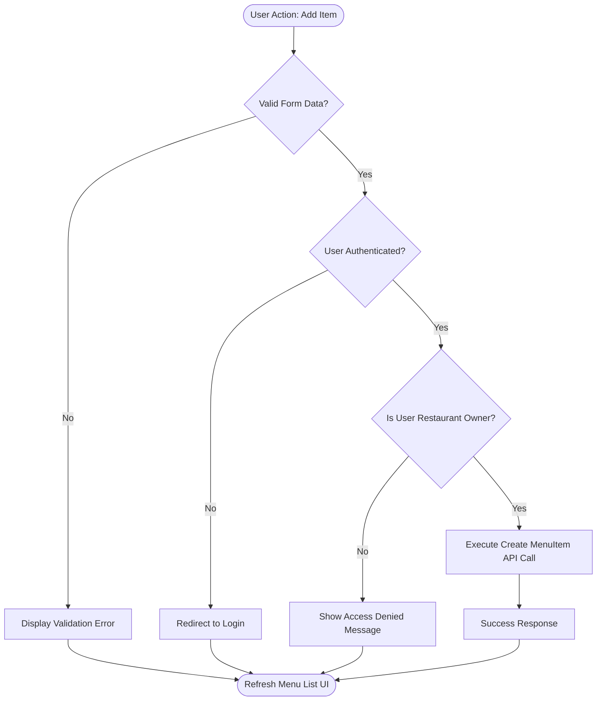

# System & Software Design Specification

<!--
MERMAID SYNTAX GUIDE:
✅ CORRECT: API[Create Post API Call]
✅ CORRECT: Process[Execute Business Logic]
✅ CORRECT: DB[Store in Database]

❌ INCORRECT: API[manifest.from('posts').create({data})]
❌ INCORRECT: Process[updateState({newData})]
❌ INCORRECT: Function[handleClick(event)]

Use descriptive labels without code syntax, braces, or parentheses.
-->

## 1. Design Foundation

### 1.1 Design Inputs
**Requirements Source:** ./requirements-definition.md

**Key Design Drivers:**
*   **US-002, US-003:** The need for owners to manage their own data drives the use of `condition: self` policies.
*   **US-004, US-005:** The requirement for public data discovery drives the use of `access: public` read policies for Restaurants and MenuItems.
*   **CF-001:** The need for user accounts drives the implementation of the `authenticable` feature in Manifest.

**Design Constraints:**
The design must exclusively use the Manifest SDK for all backend interactions, avoiding direct `fetch` calls. The frontend architecture is limited to a two-screen (Landing, Dashboard) SPA model to maintain simplicity and align with platform standards.

### 1.2 Design Decisions
**Architectural Pattern Selected:**
A client-server, layered architecture is chosen. The React frontend acts as the presentation layer, communicating with the Manifest backend (business/data layer) via its auto-generated REST API through the SDK. This pattern cleanly separates concerns.

**Key Design Choices:**
*   **State Management:** Local component state (`useState`) and prop drilling will be used instead of a global state manager (like Redux) to keep the application simple and self-contained.
*   **Authentication Flow:** A token-based authentication flow managed by the Manifest SDK will be used. User session is checked on application load.
*   **Singleton SDK Instance:** A single, persistent instance of the Manifest SDK will be created using `useRef` to prevent re-initialization on re-renders and ensure stable connection management.

**Alternative Approaches Rejected:**
*   **Server-Side Rendering (SSR):** Rejected because a client-rendered SPA with React is sufficient for the application's needs and aligns with the target stack.
*   **Global State Library:** Rejected to minimize complexity and dependency overhead for an application of this scale.

## 2. Visual Architecture Models

### 2.1 System Architecture Diagram

**Architecture Rationale:**
This layered architecture clearly separates the user interface from the business logic and data storage. React is responsible for rendering the UI, Manifest handles all backend logic including authentication, authorization, and data operations, and the database is purely for persistence. This separation simplifies development, testing, and maintenance.

### 2.2 Component Integration Flow

## 3. Database Design Architecture

### 3.1 Entity Relationship Model

### 3.2 Schema Design Decisions
[LLM fills: Database design rationale - indexing, constraints, performance optimizations]

| Design Decision | Technical Rationale | Performance Impact |
|----------------|---------------------|-------------------|
| Add `ownerId` to `MenuItem` | Directly associates a menu item with a user, simplifying ownership-based policy checks (`condition: self`) at the database level. | Minor write overhead, but significantly improves read performance for authorization checks. |
| Use `money` type for price | Ensures data integrity and precision for financial values, handled automatically by the backend. | Neutral; leverages built-in database types optimized for currency. |
| Public read access | Data for restaurants and menus is non-sensitive, so allowing public reads simplifies data fetching for all users and reduces backend load from authorization checks. | Positive; reduces query complexity and improves response times for public data. |

### 3.3 Data Flow Architecture

## 4. API Design Patterns

### 4.1 API Interaction Design

**API Design Patterns:**
The system uses a standard RESTful API pattern auto-generated by Manifest. All interactions follow REST principles (e.g., POST for creation, GET for retrieval). Responses are in JSON format, and standard HTTP status codes are used for success and error states.

### 4.2 Frontend Integration Patterns
The React frontend interacts with the backend exclusively through the Manifest SDK. A singleton instance of the SDK is maintained. Data fetching functions are defined in the main `App.jsx` component and passed down as props. This centralizes API logic and promotes component reusability.

## 5. Component Design Architecture

### 5.1 React Component Patterns

### 5.2 Design Patterns Applied
[LLM fills: Component design patterns used - Container/Presenter, Custom Hooks, etc.]

| Pattern | Implementation | Benefits | Trade-offs |
|---------|----------------|----------|------------|
| Container/Presenter | `App.jsx` acts as a container, managing state and logic. `LandingPage` and `DashboardPage` are presenter components that receive data and functions as props. | Separation of concerns, easier testing of UI components. | Can lead to prop drilling in more complex applications. |
| Singleton | The Manifest SDK instance is created once using `useRef` and reused throughout the app's lifecycle. | Prevents unnecessary re-instantiations, improves performance, and ensures a stable connection. | Requires careful initialization logic to avoid race conditions. |

## 6. System Behavior Models

### 6.1 State Transition Design

### 6.2 Interaction Flow Design

### 6.3 Algorithm Design

## 7. Design Validation & Traceability

### 7.1 Requirements Mapping
[LLM fills: How design components implement specific requirements - reference requirement IDs without repeating content]

| Design Component | Requirement Reference | Implementation Approach | Validation Method |
|------------------|---------------------|------------------------|-------------------|
| `MenuItem` Entity with `belongsTo: User` | US-003, AC-003 | Enforces ownership at the schema level, enabling `condition: self` policy. | API testing; attempt to create/update an item as a non-owner should fail. |
| `Restaurant` Entity `read: public` policy | US-004, US-005 | Allows unauthenticated fetching of restaurant data. | Frontend testing; verify restaurant list loads for logged-out users. |
| `App.jsx` Auth State | CF-001 | A `user` state variable controls which screen (Landing/Dashboard) is rendered. | Unit test the screen switching logic based on the user state. |

### 7.2 Architecture Consistency
The design is internally consistent. The layered architecture, singleton SDK pattern, and centralized API logic in `App.jsx` work together to create a cohesive and maintainable system that aligns with React best practices.

### 7.3 Implementation Feasibility
The design is highly feasible. It relies entirely on standard, documented features of the Manifest and React frameworks. No custom or experimental technologies are required, ensuring a straightforward implementation.

### 7.4 Performance Design Strategy
Performance is addressed by using public read policies to avoid unnecessary authorization overhead on public data. The frontend uses efficient data fetching (only on mount) and a singleton SDK instance to minimize network requests and client-side processing.

---

**Design Metadata:**
- **Generated:** 2023-10-27
- **Requirements Source:** ./requirements-definition.md
- **Architecture Pattern:** Layered Client-Server
- **Design Status:** Implementation-ready design specification